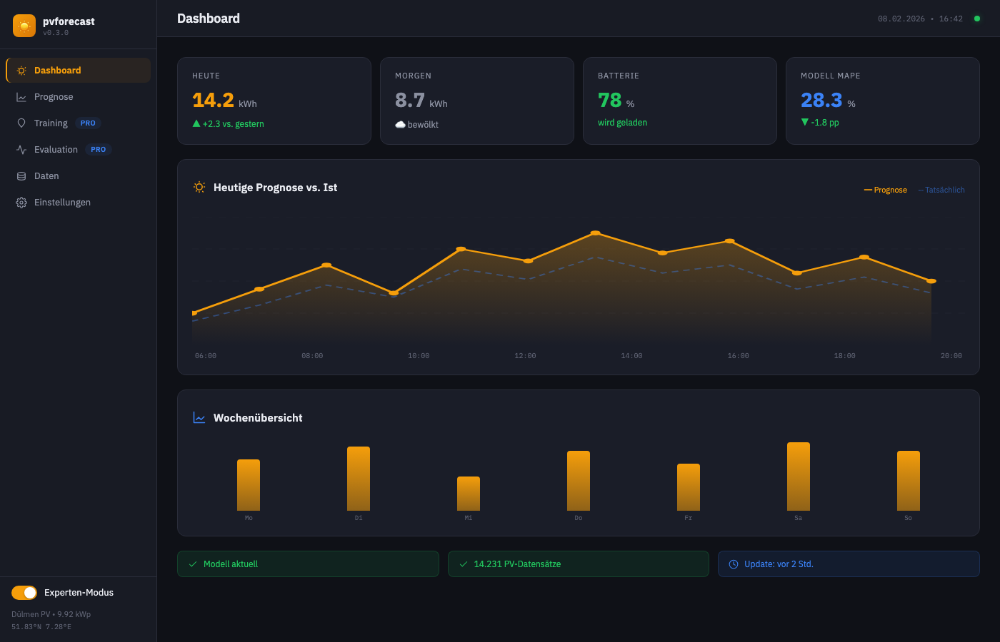
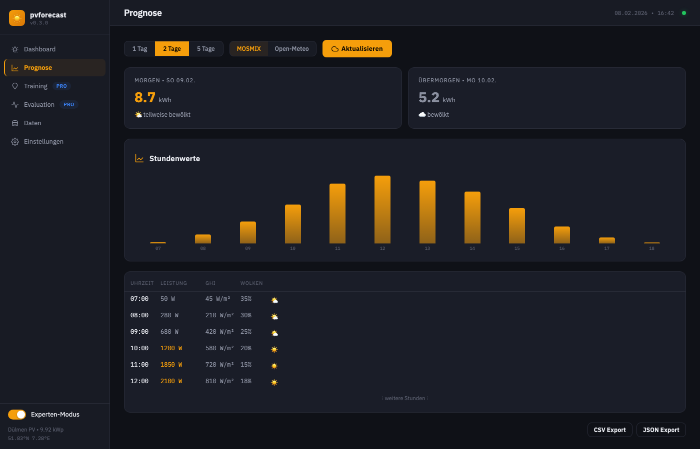
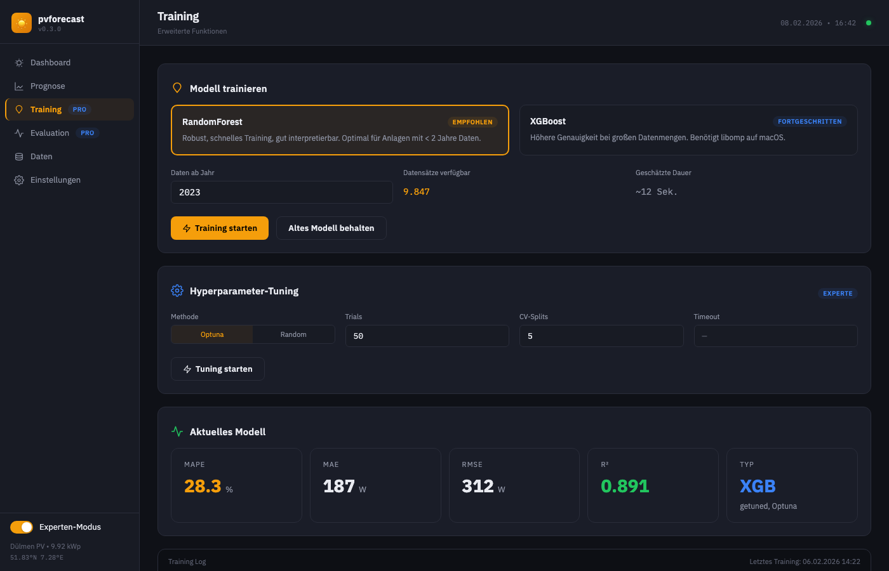
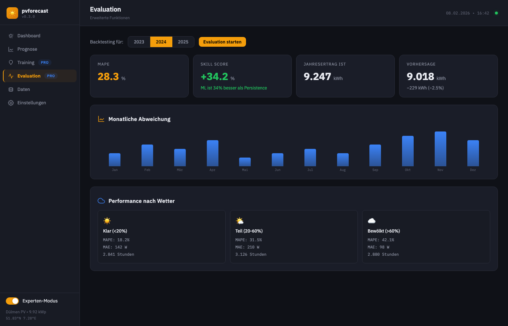
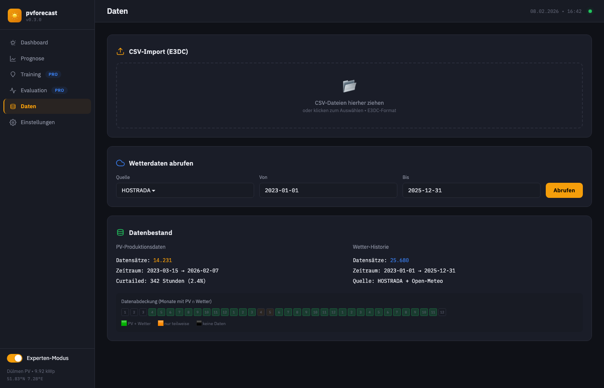
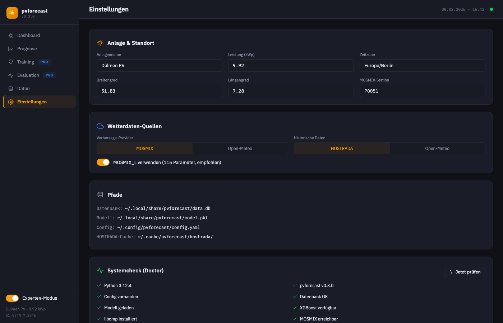

# pvforecast GUI Mockup

Interaktiver Prototyp für die geplante Web-GUI basierend auf NiceGUI.

📂 **[mockup.html](mockup.html)** – Lokal im Browser öffnen für interaktive Demo

---

## Screenshots

### Dashboard
Übersicht mit Tagesprognose, Wochenvergleich und Systemstatus.

### Prognose
Mehrtages-Vorhersage mit Stundenwerten und Wetterdaten.

### Training *(Experten-Modus)*
Modellauswahl, Hyperparameter-Tuning und Training-Logs.

### Evaluation *(Experten-Modus)*
Backtesting mit Skill Score und Wetter-Breakdown.

### Daten
CSV-Import, Wetterdaten-Abruf und Datenbestand-Übersicht.

### Einstellungen
Anlagenkonfiguration, Wetter-Quellen und Systemcheck.

---

## Features

- 🌙 **Dark Theme** mit IBM Plex Fonts
- 🔄 **Experten-Modus** Toggle (blendet Training & Evaluation ein/aus)
- 📊 **Plotly-Style Charts** (als Mockup)
- 📱 **Responsive Sidebar**

## Tech Stack (geplant)

- **Backend:** NiceGUI (FastAPI + Vue/Quasar)
- **Charts:** Plotly
- **Styling:** Quasar Components

Siehe auch: [GUI-ANALYSIS.md](../docs/GUI-ANALYSIS.md)
